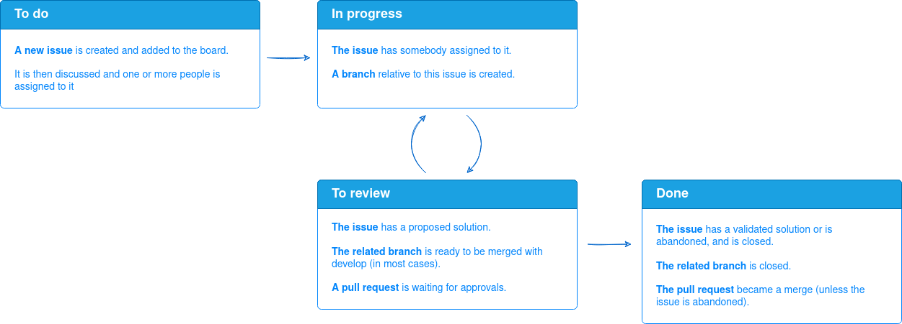

# How to contribute

This section gathers the conventions and development practices used in the project, presented over the following topics:

* [Boards](#boards)
* [Issue lifecycle](#issue-lifecycle)
* [Branches](#branches)
* [Development of a new feature or implementing a new fix](#development-of-a-new-feature-or-implementing-a-new-fix)
* [Workflows](#workflows)
* [Submission of a new version](#submission-of-a-new-version)
  * [Generate the documentation](#generate-the-documentation)
  * [Submit to TestPyPI](#submit-to-testpypi)
* [References](#references)

## Boards
The project presents three different boards, located on the [Boards page](https://github.com/soline-b/c-major-transposition/projects). Their names are the following:
* Documentation
* Features
* Project Monitoring.

They are destined to the most predictable issues of the project.

The `Documentation` board is focused on the global parts of the documentation.
It could refer to a new chapter that could be useful, tutorials or issues relative to the global architecture of the documentation.
Features or fixes documentation should be done when adding or fixing the entity (see [Developing a new feature or implementing a new fix](#developing-a-new-feature-or-implementing-a-new-fix)).

The `Features` board is focused on the predictable features and evolution of CMajorTransposition. It concerns wanted evolutions of the module, unlike the bugs, which will not be added to a board and are inclined to be more critical in general.

The `Project Monitoring` board refers to tasks related to the project management, such as the orchestration of CI/CD. The project is still new, thus its organization is likely to evolve over time.

Each card of a board has to be converted to an issue when created.
Thus, it has a issue ID to refer to, namely while creating the associated branch.
More details of the issue lifecycle, and the organization of the boards, are provided is the section [Issue lifecycle](#issue-lifecycle).

## Issue lifecycle
Each one of the board presented in the [previous section](#boards) contains the following columns.
The presence of an issue/card in a specific columns depicts the following prerequisites:

| Column name | Quick description of the content                                                                      |
| ----------- | ----------------------------------------------------------------------------------------------------- |
| To do       | The idea/tasks has been submitted                                                                     |
| In progress | One or more people have been assigned to the task                                                     |
| To Review   | The task is done and submitted, waiting for review                                                    |
| Done        | The review has been approved or aborted, the changes are done or the task is aborted for some reasons |

The "Issue lifecycle" can be represented as follows:



## Branches
The `main` branch only hosts the released version.
Updating it requires pull requests, and reflects the submission of a new version.

The `develop` branch gathers stable versions. No fix are made directly on it.
Thus, updating it requires pull requests.

The **releases** branches are used before submitting a new version to the `main` branch.
They are named after the new version of CMajorTransposition, by the following convention: `release-x.x.x`.

An other branch (for new feature or fix) should be associated to an issue; so its name could refer
to this issue, by following the convention: `yy-short-issue-description`, with `yy` the identifier of the issue.

## Developing a new feature or implementing a new fix
A new feature or a new fix is related to an issue precedently submitted on the GitHub project.
In these cases, the issue can be related to the `Features` board (presented [above](#boards)) or to no board at all, as the bug issues are only handled on the [Issues page](https://github.com/soline-b/c-major-transposition/issues).

Implementing a new feature or a new fix implies three main concerns:
* The implementation itself
* The testing
* The documentation.

The testing is done with `nose2` and `unittest`. The unit tests are launched by a GitHub Actions workflow each time a pull request or a push is done on the branches `main` and `develop`.

## Workflows
For now, one worflow has been set up. It is described in `.github/worflows/testing.yml`.

## Submitting a new version
When new content is added to the `main` branch, two steps are manually done:
1. Generate the documentation
2. Submit the new version of the module to TestPyPI.

### Generate the documentation
The documentation is generated by using `pdoc`.
This is done through the following command:

```
pdoc -o docs/pdoc cmajortransposition
```

### Submit to TestPyPI
For now, the submission to TestPyPI is done manually when a new version is merged on the `main` branch.

This is done by building the main branch and using `twine` such as follows:

```
python3 -m twine upload --repository testpypi dist/*
```

## References
* [Nose2](https://docs.nose2.io/en/latest/)
* [Unittest](https://docs.python.org/fr/3/library/unittest.html)
* [GitHub Actions](https://github.com/features/actions)
* [Pdoc](https://pdoc.dev/)
* [Twine](https://twine.readthedocs.io/en/latest/)
