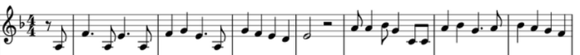

# User documentation

## Overview

## Quick start

## Examples

In this example, we learn to:
1. Create a sheet music
2. Check if this sheet music is transposable
3. Transpose this sheet music if it is.

### 1. Create a sheet music

In this project, a sheet music contains notes presenting a specific tone, regardless of their rhythms. Thus, it can be constructed from a notes array.

The notes are here presented as integers, such as presented in the following array:

|  Notes  |  Related integer  |
| ------- | ----------------- |
| C       | 0                 |
| C# / Db | 1                 |
| D       | 2                 |
| D# / Eb | 3                 |
| E       | 4                 |
| F       | 5                 |
| F# / Gb | 6                 |
| G       | 7                 |
| G# / Ab | 8                 |
| A       | 9                 |
| A# / Bb | 10                |
| B       | 11                |

For our example, we consider the following partition:


It can be translated as follows:
```
[-3,5,-3,4,-3,5,7,4,-3,7,5,4,2,4,9,9,10,7,0,0,9,10,7,9,10,9,7,5]
```

Thus, the partition can be written by the following lines:

```
# Import the package
from cmajortransposition import sheetmusic

# Initialize the array of notes as int
notes_int = [-3,5,-3,4,-3,5,7,4,-3,7,5,4,2,4,9,9,10,7,0,0,9,10,7,9,10,9,7,5]

# Create the sheet music with the notes as parameters
my_sheetmusic = sheetmusic.SheetMusic(notes_int)

# Return the notes as strings
notes_str = my_sheetmusic.get_notes_as_str()

# Print the notes
print(notes_str)
```

The printed result is:

```
['A(-1)', 'F', 'A(-1)', 'E', 'A(-1)', 'F', 'G', 'E', 'A(-1)', 'G', 'F', 'E', 'D', 'E', 'A', 'A', 'A#/Bb', 'G', 'C', 'C', 'A', 'A#/Bb', 'G', 'A', 'A#/Bb', 'A', 'G', 'F']
```

### 2. Check if a sheet music is transposable

The function `is_transposable_in_c_major(self)` of the class `SheetMusic` can be used to check if a sheet music is transposable.

#### 2.a. Case of a non transposable sheet music

In the case where it is not transposable, the function returns `False`, as depicted below:

```
# Import the package
from cmajortransposition import sheetmusic

# Initialize the array of notes as int
notes_int = [0,1,2]

# Create the sheet music with the notes as parameters
my_sheetmusic = sheetmusic.SheetMusic(notes_int)

# Check if the sheet music is transposable in C major
print(my_sheetmusic.is_transposable_in_c_major())
```

The printed answer is:
```
False
```

#### 2.b. Case of a transposable sheet music

The partition used in the first step of our [examples](#examples) can be transposed in C major.
Here is the code to check this assertion:

```
# Import the package
from cmajortransposition import sheetmusic

# Initialize the array of notes as int
notes_int = [-3,5,-3,4,-3,5,7,4,-3,7,5,4,2,4,9,9,10,7,0,0,9,10,7,9,10,9,7,5]

# Create the sheet music with the notes as parameters
my_sheetmusic = sheetmusic.SheetMusic(notes_int)

# Check if the sheet music is transposable in C major
print(my_sheetmusic.is_transposable_in_c_major())
```

The printed answer is:
```
True
```

### 3. Transpose a sheet music

The function `transpose_in_c_major(self)` of the class `SheetMusic` is used to transpose a music sheet.
By using once again the sheet music we used in the previous [examples](#examples), we get the following script:

```
# Import the package
from cmajortransposition import sheetmusic

# Initialize the array of notes as int
notes_int = [-3,5,-3,4,-3,5,7,4,-3,7,5,4,2,4,9,9,10,7,0,0,9,10,7,9,10,9,7,5]

# Create the sheet music with the notes as parameters
my_sheetmusic = sheetmusic.SheetMusic(notes_int)

# Transpose the sheet music in C major
new_notes = my_sheetmusic.transpose_in_c_major()

# Update the partition with the obtained new notes
my_sheetmusic.set_notes(new_notes)

# Display the notes obtained after transposition
print(my_sheetmusic.get_notes_as_str())
```

The printed values are the following:
```
['E', 'C(1)', 'E', 'B', 'E', 'C(1)', 'D(1)', 'B', 'E', 'D(1)', 'C(1)', 'B', 'A', 'B', 'E(1)', 'E(1)', 'F(1)', 'D(1)', 'G', 'G', 'E(1)', 'F(1)', 'D(1)', 'E(1)', 'F(1)', 'E(1)', 'D(1)', 'C(1)']
```
