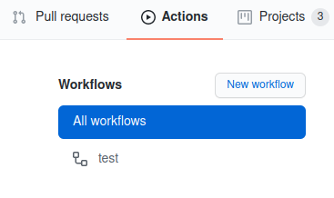
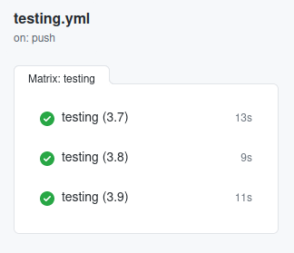
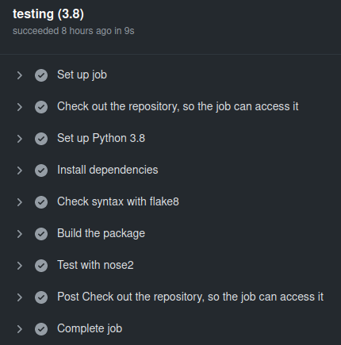

# Workflows

This project uses GitHub Actions to set up workflows. For now, the project presents only one workflow, which configuration file is located on `.github/worflows/testing.yml`.
Let's detail step by step its content.

## Testing workflow

### Overview

| Purpose           | Location                       |
| ----------------- | ------------------------------ |
| Launch unit tests | `.github/worflows/testing.yml` |

### Context

The first line defines the name of the workflow.
```
name: test
```

It appears in the [Actions page](https://github.com/soline-b/c-major-transposition/actions) such as follows:




Then, the triggers of the workflows are defined. Though if can be defined as cron jobs are, it is here focused on Git events triggers: this workflow is launched when a push or a pull request is done on the main or the develop branches.

```
on:
  push:
    branches:
      - main
      - develop

  pull_request:
    branches:
      - main
      - develop
```

Jobs are then defined. In this case, there is only one job: `testing`.
```
jobs:
  testing:
```

Each time it is triggered, the job will run on a GitHub Runner: here, it is an Ubuntu.
```
    runs-on: ubuntu-latest
```

A strategy creates a build matrix for the jobs. Here, `testing` is launch three times: one with the Python version 3.7, one using the Python version 3.8 and the last one using the Python version 3.9, resulting in three jobs.

The `fail-fast` option indicates whether or not GitHub cancels the in-progress jobs if one of the three jobs fails. It is here set to false, so that GitHub won't cancel the in-progress jobs if one of them fails.

```
    strategy:
      fail-fast: false
      matrix:
        python-version: [3.7, 3.8, 3.9]
```

### Steps
The job is defined over multiple steps, which are the following:
1. Checkout the repository
2. Set up Python
3. Install dependencies
4. Check syntax
5. Build
6. Test

```
  steps:
```

**Step 1: Check the repository**

This action, found on the Actions GitHub Marketplace, checks out the repository for the job to access it.

```
    - name: Check out the repository, so the job can access it
      uses: actions/checkout@v2
```

**Step 2: Set up Python**

This action sets up Python according to one of the version defined in the matrix presented on [Context](#context). Each of the three jobs uses a different version.

```
    - name: Set up Python ${{ matrix.python-version }}
      uses: actions/setup-python@v2
      with:
        python-version: ${{ matrix.python-version }}
```



**Step 3: Install dependencies**

By using `pip`, the different dependencies used by this job are installed.

```
    - name: Install dependencies
      run: |
        python -m pip install --upgrade pip
        python -m pip install flake8 nose2 setuptools
        if [ -f requirements.txt ]; then pip install -r requirements.txt; fi
```

**Step 4: Check syntax**

`flake8` is then used to check the source code, focusing on some errors defined in [Flake8 errors](https://flake8.pycqa.org/en/latest/user/error-codes.html)

```
    - name: Check syntax with flake8
      run: |
        flake8 . --count --select=E9,F63,F7,F82 --show-source --statistics
        flake8 . --count --exit-zero --max-complexity=10 --max-line-length=127 --statistics
```

**Step 5: Build**

The package is then build by using `setup.py`.

```
    - name: Build the package
      run: |
        python setup.py build
        python setup.py install
```

**Step 6: Test**

Finally, tests are run using `nose2`.

```
    - name: Test with nose2
      run: |
        nose2 -v

```

**Notes :**

Additional steps linked to the execution of the workflow are added by GitHub Actions, resulting in the following complete steps:




## References
* [GitHub Actions](https://github.com/features/actions)
* [GitHub Marketplace - Actions](https://github.com/marketplace?type=actions)
* [Pip](https://pypi.org/project/pip/)
* [Flake8](https://pypi.org/project/flake8/)
* [Errors of Flake8](https://flake8.pycqa.org/en/latest/user/error-codes.html)
* [Nose2](https://docs.nose2.io/en/latest/)
